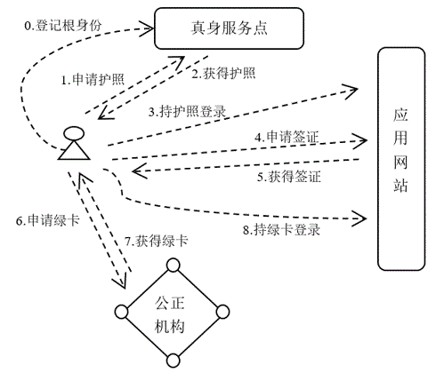

护照签证及绿卡 {: .text-center }
-----------

&nbsp;

### 最简 DID 应用场景

最简分布式身份实现可能如下：

第一步，用户创建一组随机数，用随机数生成一个钱包账号，借助软件工具，这个钱包账号能对任意信息实施签名，能提供签名就代表该用户拥有这个账号，所有权是完备的。这一步，概括去讲就是在钱包软件中新建一个账号，私钥、公钥自动生成。

第二步，用户持该账号在互联网声明身份，声明可以借助某个 DID Registry 服务节点完成，完成后用户将得到一个 DID 标识符，格式类似于： `did:ethr:0xd19e3306389600ccca3110925348e509e35742ee`。DID Registry 主要完成与账号相关的信息记录与索引构建工作，比如，对账号公钥计算哈希（哈希值在 DID 标识符中指代用户身份），用 `id` 字段为 DID 标识建立索引，再如，在 `publicKey` 字段保存账号公钥相关信息，在 `authentication` 字段保存验证该用户身份的方式。

其实，这一步并非 DID 应用本质上需要的，但如果大家都遵守 W3C 的 DID 规范，互联互通会比较容易。为描述方便，我们把账号的公钥直接视作用户的身份标识，另外，假定用户在本机启动一个包含钱包的 Web 服务程序，供外界在线调用服务，其中服务之一就是，动用上述账号对特定信息实施签名。

第三步，之后，用户就可以用自己的 DID 标识登录应用网站了。当然，相关应用网站需支持 DID 身份验证，有些网站免注册，DID 标识直接代表用户身份，有些网站要求注册一下，填写若干额外信息，为了易读，身份标识可能会换一个（程序内部仍用公钥作标识）。

用户的登录验证过程大致如下，应用网站服务器生成一个随机数 nonce，客户侧借助 Web 服务程序对包含 nonce 的登录请求做签名，返回签名字串。然后，服务器依据已自动拉取的该账号的公钥，验证签名字串，如果验证通过就准许登录。

第四步，用户在使用应用网站的过程中，若遇到需验证用户身份才能进行某项操作（比方修改用户昵称）的情况，该如何处理呢？与上述登录验证类似，服务侧出具一个包含新生成 nonce 在内的待验请求，客户侧借助 Web 服务程序对该请求实施签名，然后，服务侧验证签名，若通过就准许当前用户继续执行该项类似于修改昵称的操作。

以上是 DID 一种最简应用场景，虽然简单，但已覆盖 DID 身份体系的核心本质。基于 DID 的身份验证与授权验证，与常规中心化网站提供的账号密码方式有很大不同。根本差异在于代表所有权的 secret 表达方式（及验证方式）不同，密码比较短，容易记忆，而数字钱包账号的私钥很长，若用易输入的 base64 格式表达，需要 44 个字母，如果把常规网站需要输密码的地方，改成输入私钥，网站将变得极度难用，这是其一。

其二，传统账号密码方式下，谁拥有与证明拥有，在程序上下文运行空间前后一致，无安全泄露，而在数字钱包账号签名方式下，账号所有权归用户自己，而程序是应用网站提供的，归属他人，当程序动用私钥实施签名时，私钥可能被窥探，这不像传统账号密码方式，账号与程序都归属应用网站。所以，所有支持 DID 的系统在签名授权环节，都需采用一种类似钱包的独立程序，与应用网站的程序隔离开来，钱包以签名服务方式来支持应用网站的验权需求。

其三，传统账号密码方式下，账号不变，secret（密码）可变，而在数字钱包账号签名模式下，secret（私钥）变化它的公钥也跟随变化，也意味着，对应的用户 DID 标识也跟着变化。这让 secret 更换变得很不容易，因为用户标识变了，相当于创建了一个新用户，然后将原用户权益逐一迁移（比如数字资产要转账），原先登记的信息（如 DID 标识、public key 等）逐一变更。

相比传统方式，新方式下 secret 更加丢不起，这显然很不符合大家的日常使用习惯。而且要命的是，如果 secret 遗失，它所关联的数字资产将全部丧失，如果 secret 外泄，因为账号无法立即挂失，关联资产容易被他人盗取（除非附加特别设计，比如多签）。

以上几点是 DID 身份体系的主要缺陷，为了克服这些缺陷，同时提升易用性，我们设计了护照、签证、绿卡机制。这 3 个 DID 中的概念与大家日常已熟悉的，现实中的护照、签证、绿卡非常接近，接下来我们详细介绍。

&nbsp;

### 护照、签证、绿卡分别表达什么？

互联网世界的身份表达与身份控制，实际上映射了现实世界的通行规则。我们设想一下现实中一个人的生存状态，肯定涉及以下几个要素：

1. 他的出生地。
2. 他的居留地，居留地是长久居住的地方。
3. 居留地可能发生变化，人们总有迁徙的需求；迁徙是暂态过程，需要管理，否则这个世界会乱套。
4. 从暂时迁入到获得居留权，又是一种状态变迁，临时管理措施不好用了，权利要扩大，改按公民看待。

结合互联网 DID 身份管理的需求，我们做一下类比。一个人的居留地可以有多个，但出生地只有一个，出生地是源头，给出身份证明最容易确定他的真实身份，所以护照要由出生地的政府颁发。NBC DID 系统也颁发护照，由提供准实名认证的节点颁发护照，在护照上签名就意味着该认证机构已确认护照所记录 DID 背后指向一个真人。

一个应用网站好比是一个独立国度，比方中国公民想要进入美国，需有美方机构邀请，移民局同意后才颁发签证，签证是一次事务的许可证明。类似的，一个 NBC DID 体系中的用户，从 *真身服务点*（Real Server Point）获得护照后，他想取得某应用网站的某项服务，须持护照申请网站服务方批准，服务方若批准，就给他颁发一份签证，这份签证也是一次事务的许可证明。这里，用户之所须持护照去申请，因为护照表达一个人的真身，应用网站不希望授权给空气，也不希望授权给小猫、小狗。

然后，该用户持签证到一个公正机构（权威机构）申办绿卡，拿到绿卡后，才可以不限次数反复登录应用网站后享用各项服务。现实中，持签证换办绿卡的情况类似，获得绿卡意味着你拥有永久居留权，能享受这个国家提供的各项权利了。

以上类比有助于理解 NBC DID 中护照、签证及绿卡的功能特色。总结一下，**护照表达真身，签证表达应用网站给出许可证明，绿卡则是用户在某网站授予权利的正式凭证**。

&nbsp;

### 卡证申领流程



如上图，用户在自主创建 `DEV-ACC` 与 `ALT-ACC` 账号后，向真身服务点（Real Server Point）登记可公开真身的根身份，登记后，真身服务点将拥有该用户的可公开真身的公钥 pubkey 与链码 chaincode，所以真身服务点有能力推导它的子级账号。用户登记可公开真身只需做一次，后续申领护照则允许做无限多次。

应用网站通常要为用户提供资源（如网络存贮、数据库索引、GPU 算力等），资源需要标识，建议取用户可公开真身标识作为识别依据。这里说的资源 resource 是一种抽像概念，与提供什么服务相关，资源可视为应用网站为用户所提供的某类服务要付出的各项成本总和，比方博客网站，服务方除了提供网络存贮，还有数据库查询、上下行带宽等，可以抽象成 “托管空间” 资源。后续颁发签证、颁发绿卡等均围绕服务方的资源如何授权展开。

应用网站须支持用户以两种方式登录，一是持 *元护照* 登录，二是持 *绿卡* 登录，由真身服务点颁发的护照有两类，一类是 **元护照**，出具真身标识来代表唯一真身，另一类是 **泛护照**，隐式指向某个真身，颁发护照的服务器知道它与哪个真身有关联，但外界并不清楚它指向哪个真身。用元护照登录表示用户以真身登录，关联指向很明确，因为真身标识已出具，网站服务商可以据此对用户画像；而用绿卡登录，服务商只知用户化身，无法关联真身，数据挖掘能力大幅降低，隐私保护也得以加强。一个设计良好的应用网站，应允许用户凭绿卡登录后可使用大部分功能，只有少量关键功能（比方支付、更改配置等）才需用元护照登录。

用户登录到应用网站后，就可以申请签证了，两种登录方式（元护照或绿卡）中任一方式登录均可。应用网站给登录者颁发签证，登录者需告诉网站若干信息，包括：授权对象的泛护照、其它诸如可用时长等参数，签证实质是一份授权申明，它将记录：被授予资源的使用权限、可用时长、授权给谁、是否允许二次授权等。其中二次授权是指该签证换发绿卡后，用户持此绿卡登录是否允许他再次请求签证，以便二次换发绿卡。

授权对象必须是 *泛护照* 所记录的身份，也就是说，应用网站知道当前可用资源已授权给某个真身，但具体是哪个真身并不知晓，有可能是请求授权者自己，也可能是别人。

```
  +-------+
  | 泛护照 +---+
  +-------+   |     +---------+     +-----+
              +---->| 应用网站 +---->| 签证 |
  +-------+   |     +---------+     +-----+
  | 参数项 +---+
  +-------+
```

当用户获得应用网站颁发的签证后，他就可以到某指定的公正机构用签证换取绿卡了，公正机构为此设置的服务点，我们称为通密服务点（Crypto Server Point）。签证换取绿卡的目的在于，将被授权对象的账号换成属于同一人的另一个账号，以便切断或减缓应用网站可能借助登录者身份实施跟踪。之所以要强调要由公正机构提供签证换取绿卡服务，是因为换绿卡过程必须公正，否则，对于应用网站，他会担心一个付费账号会被无限多人使用，导致网站的利益受损，对于终端用户，他也担心绿卡会不会被通密服务点制作多份，未授权的人也获得许可，从而引发安全风险。

说明：通密服务含义为 “通用密码服务”，这是 NBC DID 技术体要求的，由专门机构或区块链节点按特定规格对外提供的免费服务，签证换取绿卡是其中一项服务。

NBC DID 中支持换绿卡的机构的公正性，主要靠技术手段去保障，包括：零知识证明、多维度二次验证、去中心化服务等。后面还会详述，总之，公正机构会依据同属证明（即，证明两个账号同属于某个真身）实现签证里指定的权利归属从被授权对象的账号迁移到另一个与之具有同属关系的账号下。**这里所提的公正机构，可以是某个值得信任的公司或政府部门，也可以是某个公共区块链系统，而且，后者应属主流选择**。

最后，在获得绿卡后，被授权用户就以绿卡所记录的化身身份，登录应用网站进行各项日常操作。因为绿卡中的化身与签证中的授权对象（即，泛身份）没有直接关联，从公开信息无法推导两者关联性，所以，持绿卡登录可以有效保护个人隐私、阻断数据挖掘。

&nbsp;

### 泛身份

NBC DID 系统中的护照均由真身服务点颁发，护照中记录的身份就是护照属主的泛身份（Generic Identity），包括元护照与泛护照，都记录泛身份，元护照相比于泛护照，主体内容一致，只是额外标注护照属主的可公开真身标识。

因为真身服务点记录每位用户的可公开真身账号的 pubkey 与 chaincode，所以它能推导各用户的可公开真身子级账号。当用户 A 想将自己的权限转授权给用户 B 时，他需事先向真身服务点请求获得用户 B 的一份泛护照，泛护照中登记的属主账号由真身服务点随机生成，用来表达被授权者（用户 B）的一个泛身份。

需强调一点，真身服务点虽能根据可公开真身标识找出对应用户，并推导其真身的下级子账号，但它并不拥有用户账号任意级别的私钥，所以，真身服务点具有推导子账号能力，却不能代替用户行使签名权力。
