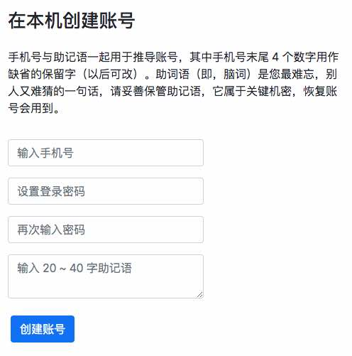
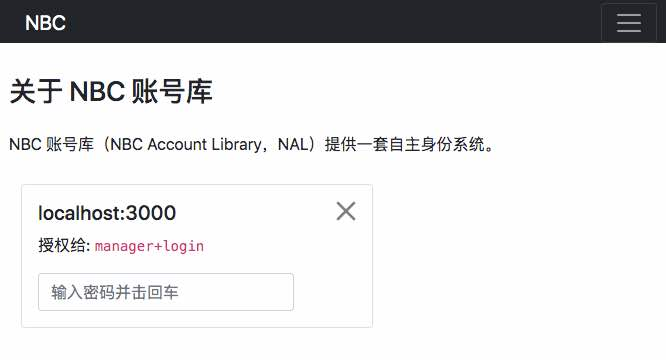
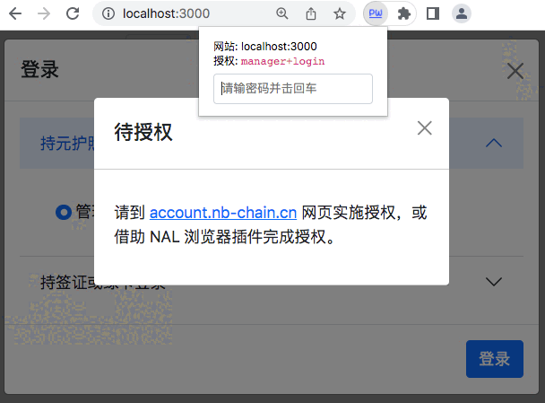
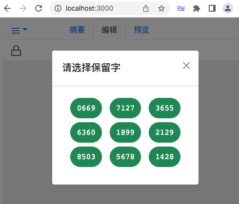

DID 账号管理器 { .text-center }
------------

&nbsp;

NBC DID 的一个关键设计目标是，让分布式身份系统变得易于使用，不仅对终端用户而言，使用起来要简单，对于基于 DID 做开发的软件设计人员，编程也需尽可能简化，DID 账号管理器就是为了实现这些目的而提出的封装方案。

&nbsp;

### 创建账号

用户在客户端设备（Client Device）的 web 页打开账号管理器网站，在 “创建账号” 页面填写助记词即可创建账号，如下图。



输入手机号、登录密码、助记词后，点击创建账号按钮，系统随即在本机创建 `DEV-ACC` 账号，并从 `DEV-ACC` 推导一个小号账号 `ALT-ACC`，小号账号作为 DID 的未公开真身，加密后保存到本机 Service Worker 进程中的数据库系统。

```
 +----------------------+
 | Client Device        |
 |                      |
 |      +----------+    |
 |      |          |    |
 | +----+----+  +--+--+ |
 | | Service |  |     | |
 | | Worker  |  | web | |
 | +---------+  +-----+ |
 +----------------------+
```

Service Worker（简称 SW）是 W3C 一项技术规范，本质上它充当了客户端网页与网络服务器（当网络可用时）之间的一个代理服务器，Service Worker 也允许通过自定义 API 为客户端网页直接提供服务，详情请参考 [Service Worker API](https://developer.mozilla.org/zh-CN/docs/Web/API/Service_Worker_API) 。

我们借助 SW 在本机实现 DID 账号管理器的后端服务，结合前端网页，完整提供账号管理功能 。

&nbsp;

### Service Worker 结构

如下图，小号账号服务（`ALT-ACC` Service）、账号管理器（Account Manager）、配置管理器（Config Manager）是驻留在 Service Worker 进程中的服务模块。

```
                             +--------------- RESTful API
                             |
 +---------------------------+---------+
 | Service Worker                      |
 |                                     +----- Message Channel
 | +---------+ +---------+ +---------+ |
 | | ALT-ACC | | Account | | Config  | |
 | | Service | | Manager | | Manager | |
 | +---------+ +---------+ +---------+ |
 | +---------------------------------+ |
 | |           DB  Service           | |
 | +---------------------------------+ |
 | +---------------------------------+ |
 | |          Cache  Service         | |
 | +---------------------------------+ |
 +-------------------------------------+
```

“小号账号服务” 主要支持：从 `ALT-ACC` 推导子账号，实施签名，验证签名等。“账号管理器” 用于管理与身份关联的护照、签证与绿卡，该模块为所有应用网站提供服务。“配置管理器” 用于管理所有应用网站与 DID 相关的配置项，每个应用网站的配置都在该管理器的 `config` 表中占据一条记录。

DB Service 提供本机数据库服务（采用 indexed DB），Cache Service 提供 web 页缓存服务。这两项连同 Service Worker 后台进程，我们都采用 W3C 规范建议的技术去搭建。

Service Worker 对外提供两种通信方式，一是 RESTful API 调用，二是浏览器已支持的消息通道，这两种通信方式都是 W3C 规范在主流浏览器已被支持的技术。

在客户端设备中，浏览器可以同时打开多个应用网站，Service Worker 进程始终只启用一个，一个 SW 进程为所有已打开的应用网站提供服务，如下图。

```
 +----------+  +----------+
 | app1 web |  | app2 web | ...
 +----------+  +----------+
 +-----------------------------+
 |      Service   Worker       |
 +-----------------------------+
```

这些应用网站，均使用 NBC Account Library（简称 NAL）进行开发，NAL 库是为了简化基于 NBC DID 身份架框的应用开发，而对底层进行抽象，形成一套有统一规格的 lib 库系统 。

&nbsp;

### 代理签名

在传统的账号密码鉴权方式下，账号与鉴权程序都归应用网所有，而在数字钱包的账号签名方式下，账号归属于用户自己，鉴权程序归应用网站。我们为了避免鉴权程序窥探 DID 账号签名过程，将签名过程表达为一种服务，由 Service Worker 提供，非官方的账号管理器网站无权触碰所有与 DID 账号私钥相关的操作（包括签名、带私钥的子账号推导等），这就避免了各家应用网站请求用 DID 账号签名时，账号私钥容易外泄的问题。

当某个应用网站需要 DID 签名时，它可以向 SW 发送服务请求，然后在官方网页输密码确认身份后，触发后台 SW 进程完成签名，见下图。签名结果将缓存到 indexed DB 中，应用网站向 SW 多次发请求轮询，在结果就绪时取回。



不过，上述模式存在一个操作不便的地方。每次在某应用网站的页面发起签名请求，都要切换到官方的账号管理器网站去输密码完成授权，然后切回到应用网站的页面继续工作。

为解决切换麻烦的问题，我们提供一个开源的浏览器插件，称为 NAL 插件。安装该插件后，如下图所示，插件在地址栏右侧显示为蓝字 `PW` 图标。


当应用网站的某个页面需要 DID 签名时，点击该快捷图标，系统立即弹出一个密码输入框，如下图，输密码击回车后触发 SW 实施签名，这样，我们就省掉了在浏览器不同网页来回切换的麻烦 。



&nbsp;

### 账号管理器

DID 身份及授权的核心操作比较简单，就是实施签名以及对签名做验证。但由于数字签名的特点，既保安全，又保隐私，也要操作便利，三者目标同时达成不大容易，有前面 “护照签证及绿卡” 一节已有介绍。

我们引入账号管理器的目的是辅助这三个目标同时达成，其实现过程主要依赖于：

1. 用护照、签证、绿卡机制，解决安全授权与隐私保护的问题，相关原理前文已介绍，不赘述。
2. 以应用网站为单位，借助 DB 自动管理护照、签证、绿卡，过时卡证能自动续期。
3. 采用 *策略定义* 表达缺省的，基于角色的授权逻辑定义，让编程变简单，也让用户界面操作变简单 。

&nbsp;

##### 护照、签证、绿卡的时效管理

护照与签证设有 account 字段，在该字段记录卡证的属主身份，即相应账号的公钥或公钥哈希值。公钥与公钥哈希值用于表达身份时，可视作等效，记录公钥能方便的取此公钥来验证签名，而记录公钥的哈希值便于隐藏公钥，有利于隐私保护。绿卡不设 account 字段，但鉴权时会临时传递该卡属主 account 的公钥值，所以，SW 在 indexed DB 对每份当前尚且有效的卡证，都记录其属主（即当前用户的某个化身）。 

护照、签证、绿卡还用 realm 字段记录该卡证归属的领域，比如取值为 `netlog.nb-chain.cn+manager` 表达当前卡证颁发给 `netlog.nb-chain.cn` 网站的 `manager` 角色使用。realm 字段中的 `"+"` 号用来串接多个子域，比方 `netlog.nb-chain.cn+manager+login` 表达 `netlog.nb-chain.cn` 网站的 `manager` 角色的 `login` 操作域。

护照、签证、绿卡还用 cert_expired 字段记录该卡的失效时间。

依据上述 3 种字段，Service Worker 借助 indexed DB 对已有卡证实施分类管理。把卡证存入数据库，查找时，SW 一般先按卡证属于哪个网站进行检索，然后结合卡证类型（护照、签证、绿卡）、有效期等信息进一步定位。

护照与绿卡的有效期缺省按创建后过 2 周失效来处理，签证的有效期则由用户申领时自行指定，可以很短，比方过 3 天就失效，也可以很长，比方 20 年才失效。当用户持 *元护照* 登录某应用网站时，SW 将尝试从 DB 提取一份归属于该网站，类型与时效均匹配的元护照，如果没找到匹配项，就自动发起向 realname server 新申请一份，请申请元护照会缓存到 DB。同样，当用户持 *签证* 登录应用网站时，SW 也尝试从 DB 提取一份未过期、类型也匹配的绿卡，如果没找到匹配项，也自动持签证向预先指定的 *公正机构* 发起绿卡申请，申领成功后绿卡被缓存，两周内该绿卡可以反复用作登录凭证 。

&nbsp;

##### 角色与策略定义

NBC DID 系统在 “操作” 层面支持单项授权，操作（Action）归属于 “角色”，角色（Role）可以理解为用户登录一个应用网站所用的身份。登录采用的身份可以有多个，比方登录某个博客网站，用户既可以用 “主编” 身份登录，也可以用 “读者” 身份登录，还可以用 “管理员” 身份登录。

NBC DID 支持三种授权验证方式。其一，输对密码后 SW 就准许实施签名。其二，SW 给出一份保留字列表（通常是 3 行，每行 3 项，共 9 个候选词，见下图），从候选词中选对事先预留的那一项，就算验证通过。两种方式中，前者称为密码 pass 验证，后者称为保留字 rsvd 验证。其三，pay 验证，对应于 [安全等级](#2) 一节提到的 “基于可信身份执行的支付级别的操作”，留待后文介绍。



由于后者九选一的验证方法不够严谨，我们通常不会独立使用 rsvd 验证，而将它用作辅助手段，比方，在 pass 验证通过后的一定时限内，可以只验 rsvd 保留字，pass 验证因为要手动输入密码，有点繁琐，rsvd 验证只需从界面给出的九个项目中选取一项，操作便利些。

如果 rsvd 验证失败，Service Worker 会要求随后的验证必须先完成一次 pass 验证，也就是说，用户要输对一次 password，SW 才能恢复正常 。

为了让安全控制更简便，也更易于理解，NBC DID 在策略定义时增加了 “安全级别” 的概念，安全级别的数值越高，安全要求就越高。策略定义涉及的 “角色” 也赋予 “固有安全级别” 定义，如果用户以某 “角色” 登录网站，他的各项操作将自然拥有 “固有安全级别” 的权限。在指明 “auto” 方式授权时，若某操作所需的 “安全级别” 小于这个 “固有安全级别” 时，系统将自动授权（不必输 password 或从列表中选保留字），而当操作所需的 “安全级别” 大于或等于角色的 “固有安全级别” 时，则需执行预定义的授权操作（即，输 password 或从列表选保留字）。

下面给出一份应用网站的 “策略定义” 样例。

``` json
{
  "strategy_ver": 1,
  "session_type": 2,
  "session_limit": 4,
  "meta_pspt_expired": 12,
  "roles": {
    "manager": {
      "level": 6,
      "desc": "管理员",
      "actions": {
        "open_locker": "rsvd",
        "close_locker": "auto",
        "statistic": "auto",
        "read_file": "auto",
        "write_file": "auto",
        "archive": "pass",
        "authority": "pass"
      }
    },
    "editor": {
      "level": 5,
      "desc": "主编",
      "actions": {
        "open_locker": "rsvd",
        "close_locker": "auto",
        "statistic": "auto",
        "read_file": "auto",
        "write_file": "auto",
        "authority": "pass"
      }
    },
    "reader": {
      "level": 3,
      "desc": "读者",
      "actions": {
        "statistic": "auto",
        "read_file": "auto",
        "authority": "pass"
      }
    }
  },
  "actions": {
    "statistic": 1,
    "read_file": 2,
    "authority": 2,
    "close_locker": 3,
    "open_locker": 4,
    "write_file": 4,
    "archive": 5
  }
}
```

上面定义的根级 actions 子项，给出所有受支持的 “操作” 的列表，同时它还定义了各项操作所需的 “安全级别”。roles 子项列出 manager 管理员、editor 主编、reader 读者共 3 种角色定义。具体到每个角色，又在子级用 `level` 字段指定该角色的 “固有安全级别”，子级还用 `actions` 指定该角色可用的 “操作” 列表，各项操作还预设 `pass, rsvd, pay, auto` 四者之一的验证方式，其中取值 `auto` 的含义见上面介绍，取值 `pass` 或 `rsvd` 表示明确使用 pass 验证或 rsvd 验证，而不必分析操作所需 “安全级别” 与当前 “固有安全级别” 之间的大小关系 。

&nbsp;

### 账号管理器的布署

鉴于账号管理器是本体系的安全源头，我们采取开源与自主布署的策略来确保安全。

[账号管理器源码](https://github.com/fn-share/account) 托管在 github 网站，接受公众检验。自主布署是指，任何用户均可 fork 官方的管理器项目，fork 后的 repo 就成为他自己掌控的东西，然后把 fork 后 repo 配置成 GitHub Pages 站点，以静态页方式将项目托管到 `github.io`，用户访问自己的静态站点，即可自主创建并管理身份账号。

这个开源项目全称是 “NBC DID 账号管理器”，NBC DID Account Manager，简称账号管理器。它还被人俗称为 “NBC 钱包”，不过有点背本意了，官方并不提倡。
